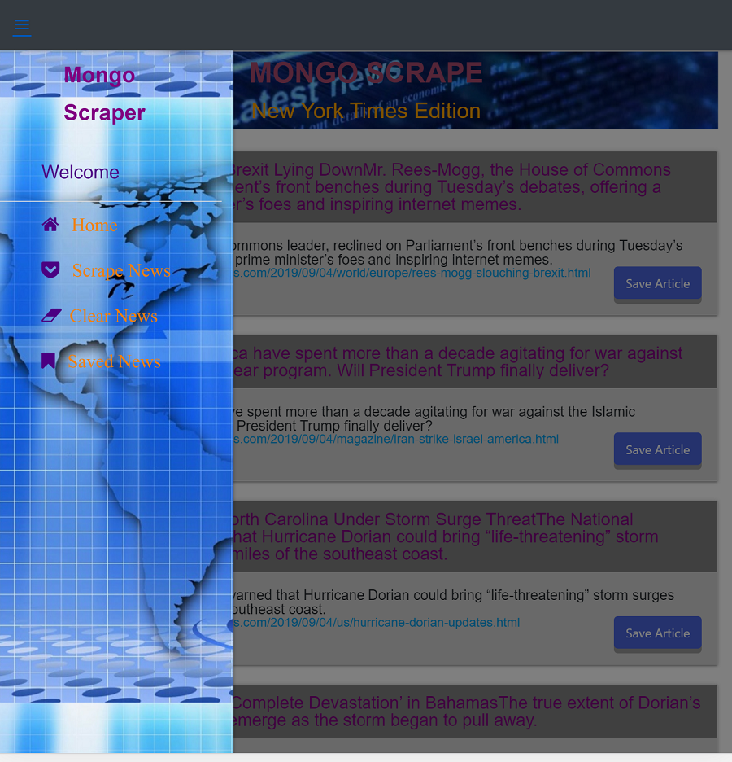
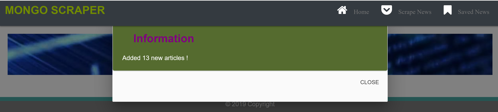
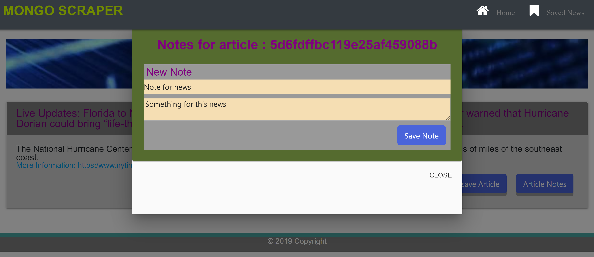
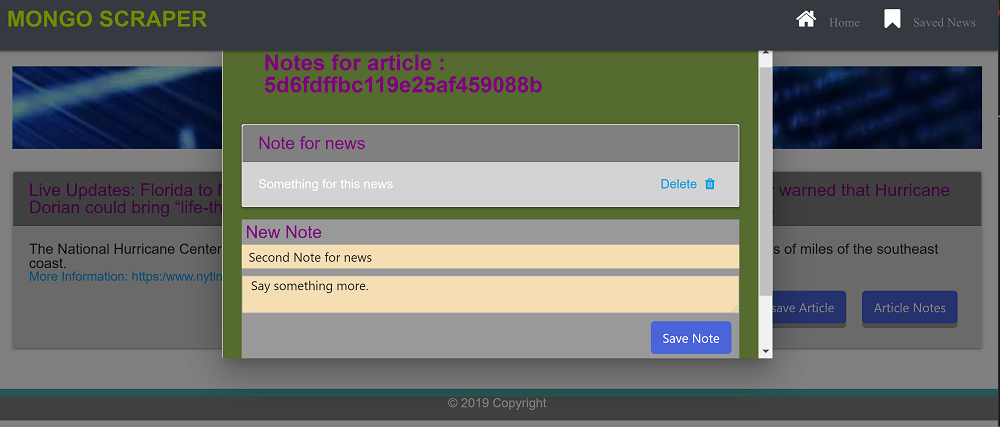
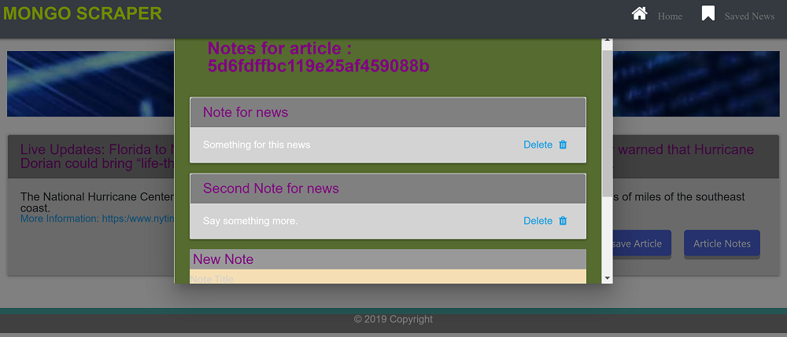
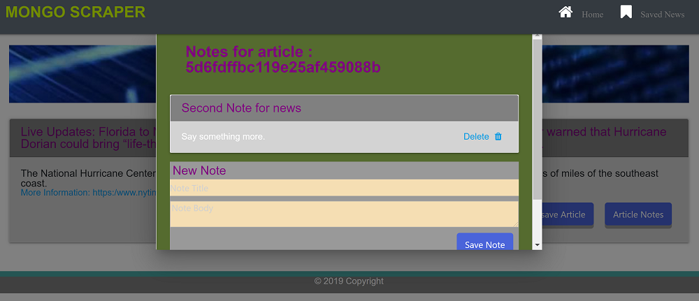
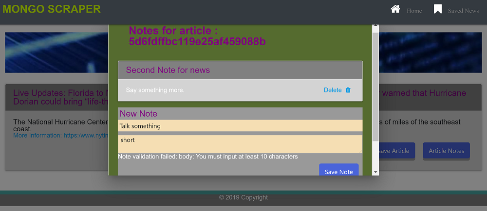

# News-Scrape

# News-Scrape

### Overview

* E

### App Live Link


### APP HEROKU GIT LINK


### App GitHub Link
https://github.com/helenhao888/News-Scrape.git

### Developer
    Developed by Helen Hao (helenhao888)
    
### Technologies
    Node.js 
    Express
    Handlebars
    MongoDb
    Mongoose
    MVC design 
    javascript
    jQuery
    HTML
    CSS
    Materialized CSS
    HeroKu/GitHub

### Screenshots
1. Responsive Design
    Large Screen.
   
    Small Screen.
   
2. Scrape News
   When user clicks scarpe news button,it gets all the news from NY Times website and stores them in database.Then Display them on the screen.
   
   
   

3. Save Article
   Save article.
   
   Saved article.
   
4. UnSave Article
    Unsave article
      

5. Add Notes
    Add a note for an article.
      
   Add another note for an article.
      

6. Delete Note
    Before deleting note
   
    After deleting note
   
7. validation check 
   Validate input fields. 
   
  

#### Directory structure
```
│ 
├── routes
│   └── router.js
│ 
├── models
│   └── index.js
│   └── News.js
│   └── Notes.js
│ 
├── node_modules
│ 
├── package.json
│
├── public
│   └── assets
│       ├── css
│       │   └── style.css /reset.css
│       └── img
│       └── js
│           └── newsScrape.js
├── server.js
│
└── views   
    └── layouts
        └── main.handlebars
    └── news.handlebars
    └── savedNews.handlebars

```
### Contact Information

   Helen Hao :
   :link:[linkedIn](https://www.linkedin.com/in/jinzhao-helen-hao-611b3752/) 
   :link:[Portfolio](https://helenhao888.github.io)    
