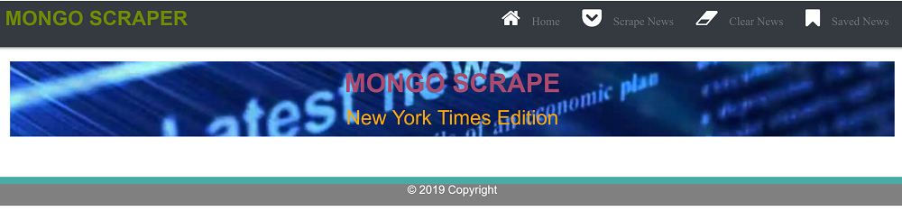
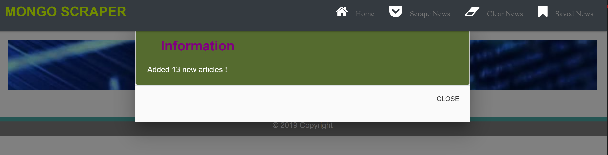
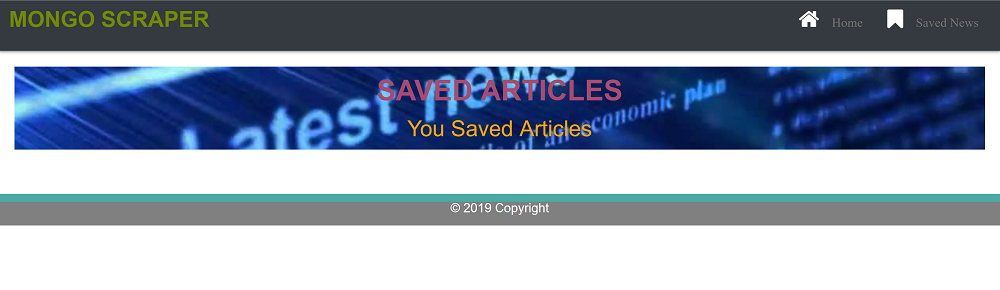

# News-Scrape


### Overview
The news scrape is a web app that gets the latest news from NY times website and lets users view and leave comments on the news. It accomplishes the following:

  1. Whenever a user visits this site, the app should scrape stories from the latest news from the NY times website and display them for the user. Each scraped article is saved to the application database. The app scrapes and displays the following information for each article:

     * Headline - the title of the article

     * Summary - a short summary of the article

     * URL - the url to the original article (user can click this link to see the whole story)

  2. User can select articles and save them. All the saved articles can be displayed on the saved news page. 
     User also can unsave an article later.

  3. Users can should also be able to leave comments on the articles displayed and revisit them later. The comments are saved to the database as well and associated with their articles. Users also are able to delete comments left on articles. All stored comments are visible to every user.


### App Live Link


### APP HEROKU GIT LINK


### App GitHub Link
https://github.com/helenhao888/News-Scrape.git

### Developer
    Developed by Helen Hao (helenhao888)
    
### Technologies
    Node.js 
    Express
    Handlebars
    MongoDb
    Mongoose
    MVC design 
    javascript
    jQuery
    HTML
    CSS
    Materialized CSS
    cheerio
    axios
    HeroKu/GitHub

### Screenshots
1. Responsive Design
   * Large Screen.
   
   * Small Screen.
   
2. Scrape News
   * When user clicks scarpe news button,it gets all the news from NY Times website and stores them in database.Then Display them on the screen.
   
   
   

3. Save Article
   * Save article.
   
   * Saved article.
   
4. UnSave Article
   * Unsave article
      

5. Add Notes
   * Add a note for an article.
      
   Add another note for an article.
      

6. Delete Note
   * Before deleting note
   
   * After deleting note
   
7. validation check 
   * Validate input fields. 
   
  

#### Directory structure
```
│ 
├── routes
│   └── router.js
│ 
├── models
│   └── index.js
│   └── News.js
│   └── Notes.js
│ 
├── node_modules
│ 
├── package.json
│
├── public
│   └── assets
│       ├── css
│       │   └── style.css /reset.css
│       └── img
│       └── js
│           └── newsScrape.js
├── server.js
│
└── views   
    └── layouts
        └── main.handlebars
    └── news.handlebars
    └── savedNews.handlebars

```
### Contact Information

   Helen Hao :
   :link:[linkedIn](https://www.linkedin.com/in/jinzhao-helen-hao-611b3752/) 
   :link:[Portfolio](https://helenhao888.github.io)    
